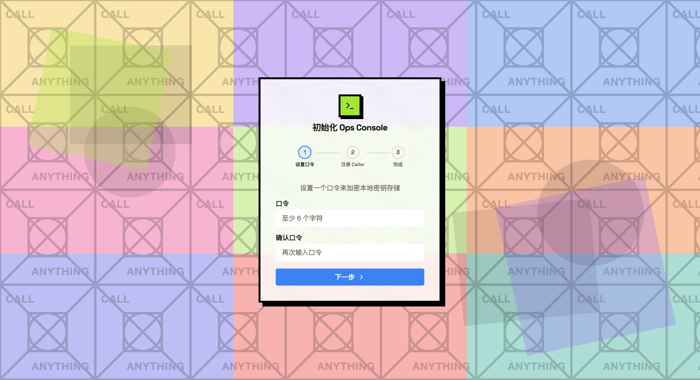
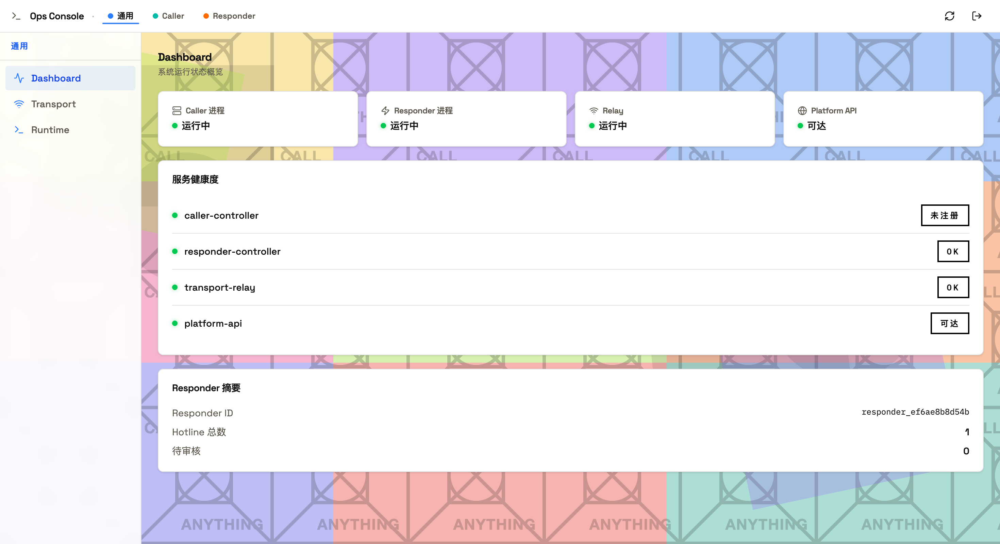
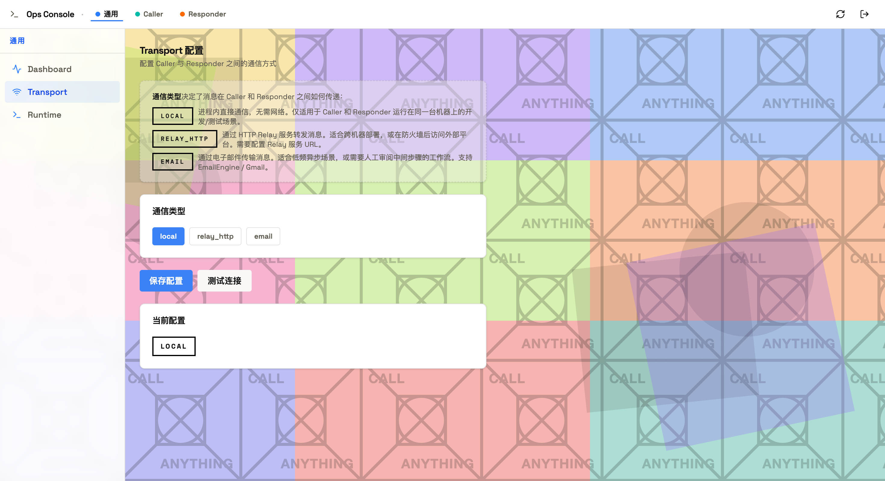
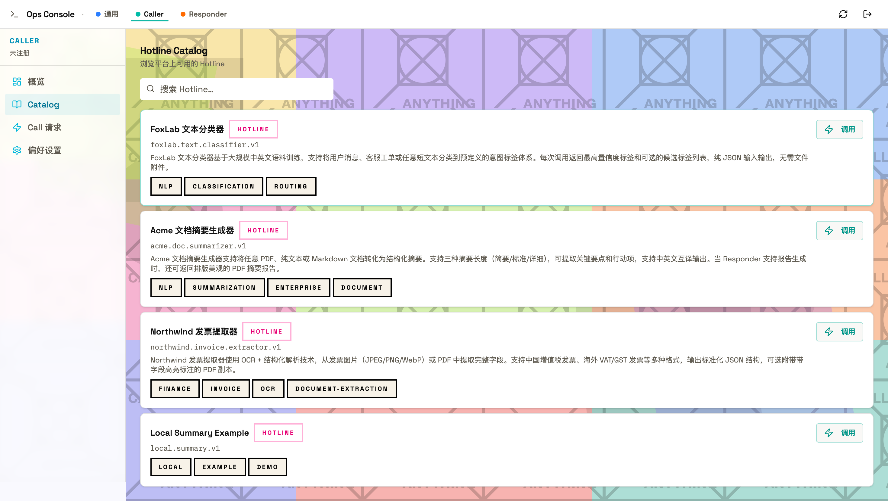
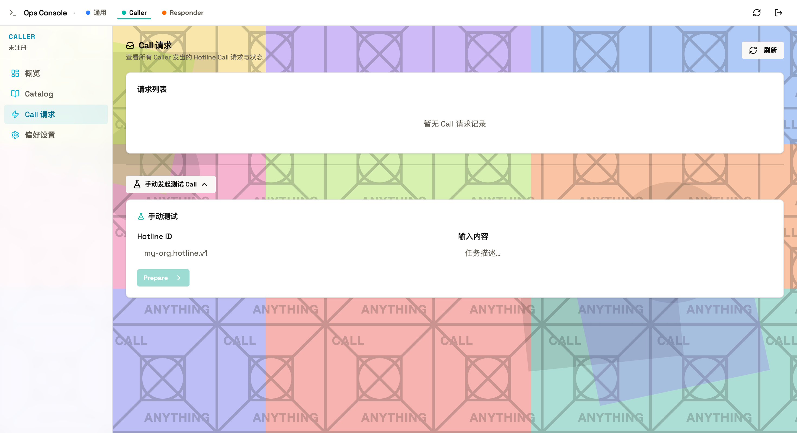
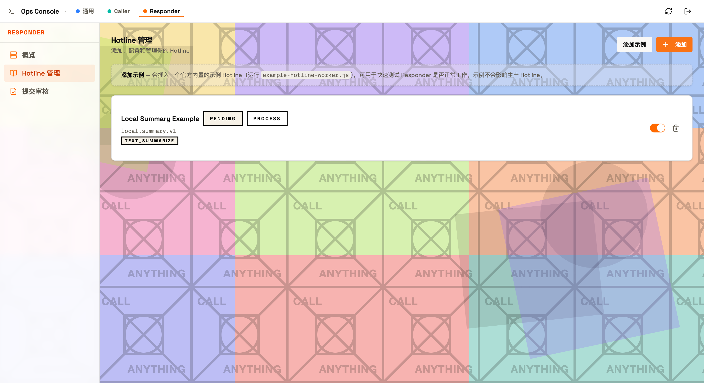

# delegated-execution-client

> 英文版：[README.md](README.md)
> 说明：中文文档为准。

委托执行的客户端运行时与本地 Web 控制台。

安装 `delexec-ops` 后，可作为 **Caller**（将任务委托给远端 Hotline）或 **Responder**（将本地项目发布为 Hotline 供他人调用）。

---

## 快速开始

### 本地模式

如果你只想在一台机器上验证 `client` 仓本地闭环，不接入 platform 审核或 catalog 发布，请先看：

[本地模式上手指南](docs/current/guides/local-mode-onboarding.zh-CN.md)

如果你希望直接让另一个 agent 代你完成安装，请从[Agent 本地安装剧本](docs/current/guides/agent-local-install-playbook.zh-CN.md)开始。

机器本地的 hotline 接入配置和 hook 文件应统一放在 `DELEXEC_HOME` 下，不要放进 git 工作区。当前本地运行时使用：

- `ops.config.json`：运行时状态
- `hotline-registration-drafts/`：热线 draft
- `hotline-integrations/`：本机接入配置
- `hotline-hooks/`：可选本机 hook stub

### Platform Bootstrap（后续流程）

platform / 社区发布不是当前仓库的主要产品路径。请先跑通本地模式，再视需要进入这条后续流程。

```bash
npm install -g @delexec/ops
delexec-ops bootstrap --email you@example.com --platform http://127.0.0.1:8080
```

Bootstrap 完成后打开本地 Web 控制台：

```bash
delexec-ops ui start --open
```

初始化向导引导你完成本地口令设置与 Caller 身份注册。



---

## Dashboard

登录后，Dashboard 实时展示所有本地服务进程的运行状态及其与平台的连通性。



服务健康度卡片展示以下状态：

- **Caller 进程** — 本地 caller-controller 运行时
- **Responder 进程** — 本地 responder-controller 运行时
- **Relay** — 本地传输中继（如启用）
- **Platform API** — 已连接平台的可达性

---

## Transport 配置

在 Transport 页面无需重启即可切换 **Local**、**Relay HTTP**、**Email** 三种传输通道。



- **Local** — 进程内直接通信，无需网络。适合开发与测试场景。
- **Relay HTTP** — 消息经 HTTP Relay 中转。适合跨机器部署或防火墙场景。
- **Email** — 基于 EmailEngine / Gmail 的异步邮件传输，支持需要人工介入的工作流。

---

## Caller — 发起委托

### Hotline Catalog

浏览并调用平台上发布的 Hotline。



每张 Hotline 卡片展示 Hotline ID、描述及能力标签，点击**调用**即可发起请求。

### Call 请求

实时追踪所有出站 Call 请求及其状态。下方的手动测试面板支持直接向任意 Hotline ID 发送测试调用。



---

## Responder — 响应委托

### Hotline 管理

将本地项目注册为 Hotline，通过一个开关即可启用或停用。Responder 侧管理哪些 Hotline 处于激活状态，并在 Hotline 进入目录前追踪其审核状态。



将本地项目挂载为 Hotline：

```bash
delexec-ops attach-project \
  --project-path /absolute/path/to/project \
  --project-name "My Local Project" \
  --project-description "说明这个项目能为远端 Caller 做什么" \
  --hotline-id local.my-project.v1 \
  --cmd "node worker.js"
```

---

## 仓库职责

本仓库负责端用户客户端运行时：

- `@delexec/ops` 产品包及 `delexec-ops` CLI
- Caller 侧本地控制流与 Responder 侧本地运行时管理
- 本地状态、密钥处理、SQLite 客户端存储及本地传输适配器
- 客户端引导、Bootstrap、诊断与排障文档

本仓库不负责协议真实来源定义，也不负责运维侧自托管平台部署。

## 公开产品面

本仓库唯一的端用户安装入口为 `@delexec/ops`。用户应通过 `delexec-ops` 使用客户端，而不是手动组合内部包。

## 内部包

本仓库包含内部实现包（caller/responder 控制器、本地存储、传输适配器）。因 `@delexec/ops` 依赖它们而保持可测试与可发布状态，但它们不是主要产品面。

## 状态

`@delexec/contracts` 已发布到 npm，本仓库可独立运行 CI 与隔离环境包检查。

## 维护说明

本仓库中部分共享包因其他仓库在拆分过渡期间仍依赖它们而单独发布。它们应被视为实现支撑包，而非主要客户端产品面。

参见：`docs/current/guides/release-surface.md`
参见：`docs/current/guides/source-integration-runbook.md`

## 如何在此仓库开发

- 当变更涉及端用户 CLI 流程、本地 caller/responder 行为、本地持久化或客户端传输连接时，从本仓库开始。
- 保持产品边界：普通用户只需要 `@delexec/ops`。
- 保持共享内部包足够稳定以支持测试与打包，但文档与示例以 `delexec-ops` 路径为核心进行优化。

推荐变更流程：

1. 若变更影响协议语义，先更新 `delegated-execution-protocol` 并消费已发布的 `@delexec/contracts`。
2. 在本仓库实现客户端运行时与 CLI 变更。
3. 发布前运行仓库 CI 与包检查。
4. 仅在其他仓库依赖时发布共享支撑包；否则以 `@delexec/ops` 作为面向用户的发布产物。
